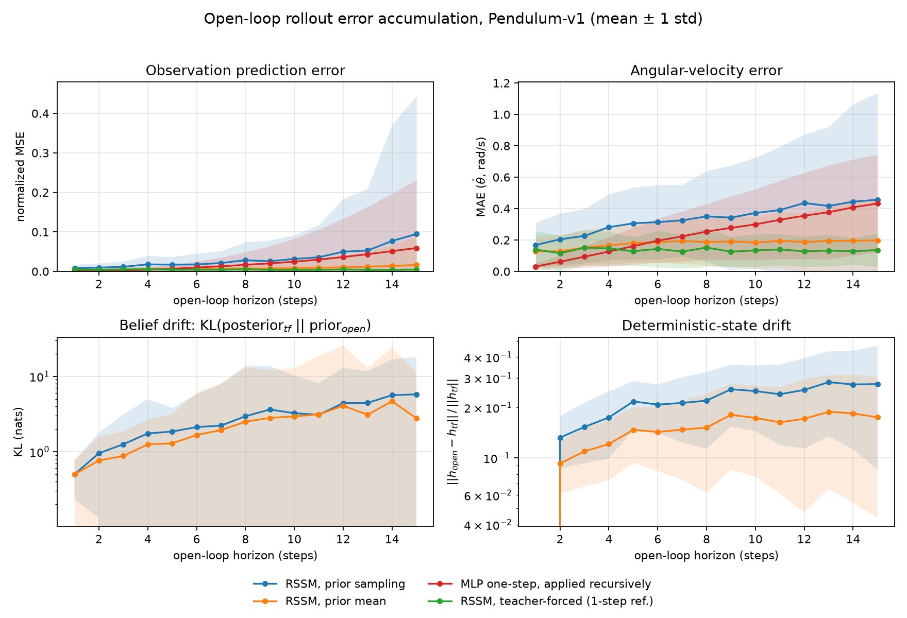

# rssm-rollout-drift

**Quantifying open-loop rollout error accumulation in a recurrent state-space world model.**

[](https://doi.org/10.5281/zenodo.23099964)

<https://github.com/Kiki-ui-coder/rssm-rollout-drift> · [technical report](report/report.md)

Archived on Zenodo: **[10.5281/zenodo.23099964](https://doi.org/10.5281/zenodo.23099964)** (v1.0.0).
The concept DOI [10.5281/zenodo.23099963](https://doi.org/10.5281/zenodo.23099963) always
resolves to the newest version.

A from-scratch PyTorch implementation of an RSSM (the architecture family behind
PlaNet and the Dreamer line), plus a controlled measurement study of how fast an
imagined rollout drifts away from the real environment on `Pendulum-v1`.

> **Scope.** This is a reimplementation and measurement study, not a new method.
> It does not propose a new architecture or algorithm, and it claims no
> state-of-the-art result. The contribution is a clean, reproducible protocol and
> an honest set of numbers.

---

## Why this repo exists

A world model is only useful for planning if its imagined rollouts stay close to
reality for long enough to plan over. Everyone who trains one hits the same wall:
one-step prediction looks great, and then multi-step imagination quietly falls
apart. This repo measures that wall instead of hand-waving about it.

Three questions, each answered with the same evaluation protocol:

1. How does observation-space prediction error grow with open-loop horizon?
2. How far does the *latent belief* drift from what the model would have
   inferred had it kept seeing the truth? (measured as `KL(posterior_tf || prior_open)`)
3. How much of the drift is caused by the stochastic latent versus by the
   recurrent deterministic path?

## Method

**Model** (`src/models.py`) — PlaNet/DreamerV1-V3 style RSSM:

```
encoder      e_t = enc(o_t)
recurrence   h_t = GRU(h_{t-1}, [z_{t-1}, a_{t-1}])
prior        p(z_t | h_t)              <- the only thing available while imagining
posterior    q(z_t | h_t, e_t)         <- used during training / teacher forcing
heads        decoder p(o_t | h_t, z_t), reward head p(r_t | h_t, z_t)
```

Latent is a diagonal Gaussian (the DreamerV1 variant). Loss per timestep is
`reconstruction MSE + reward MSE + beta * KL_balanced(q || p)`, with KL balancing
and free bits as in DreamerV3:

```
dyn = KL(sg(q) || p)             # trains the prior to track the posterior
rep = max(KL(q || sg(p)), f)     # trains the posterior towards the prior
KL_balanced = alpha * dyn + (1 - alpha) * rep
```

**Evaluation protocol** (`src/evaluate.py`), identical for every model compared:

1. Collect held-out episodes with seeds disjoint from training.
2. Teacher-forced pass over the whole episode → at every real timestep we get the
   posterior state, i.e. "what the model believes when it can still see the truth".
3. From the state at index `warmup - 1`, roll forward `horizon` steps using **only
   the prior**, applying the actions the environment actually took. No observation
   ever enters the rollout.
4. At each horizon `k`, compare the open-loop prediction against the real future
   and the open-loop prior against the teacher-forced posterior at that same index.

**Compared variants:**

| id | what it isolates |
| --- | --- |
| `rssm_stochastic` | standard recipe: sample from the prior while imagining |
| `rssm_mean` | deterministic prior mean — isolates the contribution of latent noise |
| `rssm_teacher_forced` | one-step reference, uses the posterior every step |
| `mlp_recursive` | feed-forward one-step MLP applied recursively — no latent, no recurrence |

## Results

See [`report/report.md`](report/report.md) for the full write-up. All figures in
`results/` are generated by the code in this repository; nothing is hand-drawn.

Headline numbers, 32 held-out episodes × 3 seeds, `warmup = 5`, `horizon = 15`
(normalized observation MSE; full tables in the report):

| model | h=1 | h=5 | h=10 | h=15 | per-step growth |
| --- | --- | --- | --- | --- | --- |
| `rssm_teacher_forced` | 0.0062 | 0.0055 | 0.0040 | 0.0049 | 0.995× (flat) |
| `rssm_stochastic` | 0.0076 | 0.0149 | 0.0273 | 0.0442 | 1.126× |
| `rssm_mean` | 0.0045 | 0.0053 | 0.0070 | 0.0134 | 1.086× |
| `mlp_recursive` | 0.0003 | 0.0069 | 0.0247 | 0.0592 | 1.317× |



Three takeaways:

1. **Open-loop error is multiplicative.** An exponential `err(h) ≈ exp(b·h)` fits the
   measured curves with R² = 0.93–0.96; the per-step growth factor is the clean
   horizon-independent summary.
2. **Sampling the latent is the dominant driver of drift.** Same checkpoint, same
   starting state, the only difference being `z ~ p(z|h)` versus `z = E[p(z|h)]`:
   per-step growth drops from 1.126× to 1.086×, and the error at `h = 15` drops
   from 0.0442 to 0.0134 — a **3.3× reduction** for a one-line change.
3. **The teacher-forced curve is flat** (0.995×/step, R² ≈ 0.02). That is the
   control: with an observation every step there is no compounding at all, and it
   fixes the model's reconstruction floor at ≈0.005 normalized MSE.

The recursive MLP baseline starts 15× better than any RSSM variant and ends up the
worst of the three — it falls behind `rssm_mean` around step 5 and behind
`rssm_stochastic` around step 10.

Results are seeded and reproducible: two consecutive runs of `src/evaluate.py`
produce byte-identical CSVs.

## Reproducing

```bash
git clone https://github.com/Kiki-ui-coder/rssm-rollout-drift.git
cd rssm-rollout-drift
python3 -m venv .venv
.venv/bin/python -m pip install -r requirements.txt
bash scripts/run_all.sh          # ~15 min on a laptop CPU, no GPU needed
```

`scripts/run_all.sh` trains three seeds, runs the rollout experiment and writes
`results/rollout_raw.csv`, `results/rollout_summary.csv` and the figures.

Individual steps:

```bash
python -m src.train    --seed 0 --out runs/wm_seed0
python -m src.evaluate --ckpt runs/wm_seed0/checkpoint.pt --out results
python -m src.plot     --raw results/rollout_raw.csv --out results
```

Everything runs on CPU. The compute device can be overridden with
`--device {cpu,mps,cuda}`; CPU is the default because it keeps runs reproducible
across machines.

## Layout

```
src/envs.py        Pendulum-v1 data collection (mixed random + PD controller)
src/data.py        sequence windows + normalization statistics
src/models.py      encoder, RSSM, decoder, reward head, losses
src/train.py       training loop, checkpointing
src/baselines.py   feed-forward one-step MLP baseline
src/evaluate.py    the rollout-drift protocol
src/plot.py        figures + summary CSV
results/           measured outputs (CSV + PNG), committed as-is
report/report.md   technical report
```

## Limitations

- Single environment (`Pendulum-v1`), single observation modality, 3-dimensional
  observations. The drift *rates* here are not transferable to pixel-based tasks.
- `horizon = 15` is short. Dreamer-scale planning horizons are 15-50; the protocol
  scales, the numbers in the report are specific to this setting.
- One architecture at one size (~169k parameters) and one KL configuration. No
  architecture-size ablations were run.
- Three seeds. Enough to see the spread, not enough for tight confidence intervals.

## Acknowledgements

The architecture follows Hafner et al., *Dream to Control* (DreamerV1) and
*Mastering Diverse Domains through World Models* (DreamerV3). This repository is
an independent from-scratch implementation written for study purposes; no
upstream code was copied. The environment is `gymnasium`'s `Pendulum-v1`.

## Author

Qi Jiang (姜琦) — Zhengzhou University — [@Kiki-ui-coder](https://github.com/Kiki-ui-coder)

## License

MIT — see [LICENSE](LICENSE). If you build on this, please cite via
[CITATION.cff](CITATION.cff) or the Zenodo DOI on the release page.