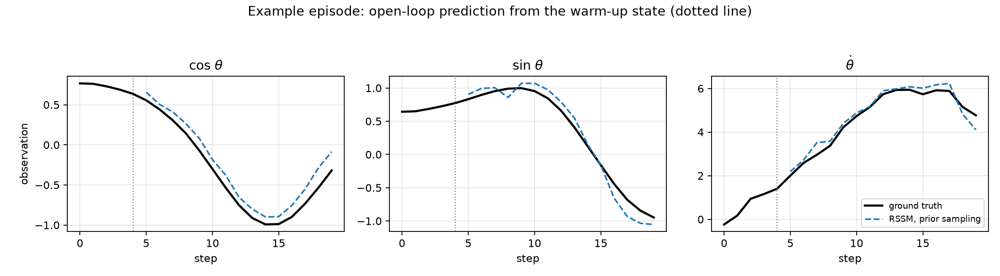

# How fast does an imagined rollout fall apart?

**Quantifying open-loop error accumulation in a recurrent state-space world model**

Qi Jiang · Zhengzhou University · October 2026

---

## Scope and honesty statement

This is a **reimplementation and measurement study**. It does not propose a new
architecture, a new objective, or a new algorithm, and it makes **no claim of
state-of-the-art performance**. The model is an independent from-scratch
implementation of the recurrent state-space model (RSSM) family described by
Hafner et al. (PlaNet, DreamerV1, DreamerV3). The contribution here is a
reproducible protocol and an honest set of measurements on one small benchmark.

Anyone evaluating this work should evaluate it as a reproduction study, not as
novel research.

## 1. Motivation

A model-based agent is useful only if its imagined rollouts stay close to reality
for long enough to plan over. In practice, everyone who trains a world model hits
the same wall: the one-step prediction error looks excellent, and then multi-step
imagination quietly degrades. The degradation is the whole ballgame — it is what
determines how deep a planning tree can go before it is planning inside a
fantasy.

The usual discussion of this failure mode is qualitative ("error compounds"). The
goal of this study is to make it quantitative on a small, fully reproducible
setting, and to separate two different things that are usually lumped together:

- **observation-level drift** — how wrong the decoded future is;
- **belief-level drift** — how far the model's latent belief has wandered from
  what it would have believed had it kept seeing the truth.

## 2. Method

### 2.1 Model

An RSSM with a deterministic recurrent path and a stochastic latent path
(`src/models.py`):

```
encoder      e_t = enc(o_t)
recurrence   h_t = GRU(h_{t-1}, [z_{t-1}, a_{t-1}])
prior        p(z_t | h_t)                 <- available while imagining
posterior    q(z_t | h_t, e_t)            <- available during training
heads        decoder p(o_t | h_t, z_t), reward head p(r_t | h_t, z_t)
```

The latent `z_t` is a 16-dimensional diagonal Gaussian; `h_t` is 128-dimensional.
The posterior network sees the encoded observation, the prior network does not —
this asymmetry is precisely what makes open-loop rollout degrade, so it is worth
stating explicitly.

### 2.2 Objective

Per timestep, summed over the sequence and averaged over the batch:

```
L = ||dec(h_t, z_t) - o_t||^2 + ||rew(h_t, z_t) - r_t||^2 + beta * KL_balanced(q_t || p_t)
```

with the DreamerV3-style KL balancing and free-bits floor:

```
dyn = KL(sg(q) || p)              # prior is trained to track the posterior
rep = max(KL(q || sg(p)), f)      # posterior is trained towards the prior
KL_balanced = alpha * dyn + (1 - alpha) * rep
```

`alpha = 0.8`, `f = 1.0` nat. Without the free-bits floor on `rep` the posterior
collapses onto a prior that has learned nothing, and the world model becomes a
pure autoencoder.

### 2.3 Evaluation protocol

Identical for every variant compared, so the numbers are directly comparable:

1. Collect held-out Pendulum episodes with seeds disjoint from training.
2. **Teacher-forced pass** over the whole episode. At every real timestep this
   yields the posterior state `q(z_t | h_t, o_t)`: what the model would believe
   if it could still see the truth. This is the reference.
3. From the state at index `warmup - 1`, roll forward `horizon` steps using
   **only the prior**, applying the actions the environment actually took. From
   this point on, no observation ever enters the model.
4. At each horizon `k`, compare against (a) the real future at absolute index
   `warmup - 1 + k`, and (b) the teacher-forced posterior at that same index.

Metric definitions:

| symbol | definition |
| --- | --- |
| `obs_mse_norm` | squared reconstruction error, normalized units (mean over dims) |
| `mae_thdot` | absolute error of `θ̇`, original units (rad/s) |
| `latent_kl` | `KL(posterior_tf ‖ prior_open)` in nats — belief drift |
| `h_rel_drift` | `‖h_open − h_tf‖ / ‖h_tf‖` — deterministic-path drift |

### 2.4 Variants compared

| id | what it isolates |
| --- | --- |
| `rssm_stochastic` | the standard recipe: sample `z` from the prior while imagining |
| `rssm_mean` | deterministic prior mean — isolates the contribution of latent noise |
| `rssm_teacher_forced` | uses the posterior at every step — the one-step reference |
| `mlp_recursive` | feed-forward one-step MLP applied recursively: no latent, no recurrence |

A note on the `mlp_recursive` comparison. Its one-step prediction is *better* than
the RSSM's, because it never passes through a latent bottleneck — it does not have
to reconstruct, it regresses the next observation directly. That makes the
*y-intercepts* of the two curves non-comparable. What is comparable, and what this
study is about, is the **slope**: how fast each model's error grows with horizon.

## 3. Setup

| | |
| --- | --- |
| Environment | `Pendulum-v1` (gymnasium), 3-dim observation `[cos θ, sin θ, θ̇]`, 1-dim torque |
| Exploration | 50% uniform-random torque, 50% PD controller on the wrapped angle |
| Training data | 120,000 env steps; validation 20,000 steps (disjoint seeds) |
| Sequences | length 50, stride 4, batch 128, 40 epochs |
| Optimizer | Adam, lr 6e-4, grad-norm clip 100 |
| Model | deter 128, stoch 16 (diagonal Gaussian), hidden 128, embed 128 → **168,772 params** |
| KL | `alpha = 0.8`, free bits `f = 1.0` nat |
| Seeds | 3 (0, 1, 2); best-val checkpoint per seed, val loss 1.14 / 1.21 / 1.32 |
| Evaluation | 32 held-out episodes, `warmup = 5`, `horizon = 15`, eval seed 777 |
| Baseline | one-step MLP (4 → 128 → 128 → 3), 25 epochs, Adam lr 1e-3, batch 256 |
| Hardware | Apple M5 Pro, CPU-only, `torch` CPU build |

## 4. Results


*Top left: observation error vs horizon. Top right: angular-velocity error. Bottom
left: belief drift, `KL(posterior_tf ‖ prior_open)`, on a log axis. Bottom right:
deterministic-path drift. Bands are ±1 standard deviation across episodes and seeds.*



*One held-out episode. The dotted vertical line is the last step at which the model
saw a real observation; everything to its right is generated open-loop.*

### 4.1 Observation error grows multiplicatively, and the floor is flat

Mean normalized observation MSE, averaged over 32 episodes × 3 seeds:

| horizon | 1 | 3 | 5 | 8 | 11 | 13 | 15 |
| --- | --- | --- | --- | --- | --- | --- | --- |
| `rssm_teacher_forced` | 0.0062 | 0.0045 | 0.0055 | 0.0053 | 0.0046 | 0.0047 | 0.0049 |
| `rssm_stochastic` | 0.0076 | 0.0100 | 0.0149 | 0.0216 | 0.0269 | 0.0385 | **0.0442** |
| `rssm_mean` | 0.0045 | 0.0044 | 0.0053 | 0.0060 | 0.0080 | 0.0096 | **0.0134** |
| `mlp_recursive` | 0.0003 | 0.0024 | 0.0069 | 0.0168 | 0.0301 | 0.0436 | **0.0592** |

Fitting `err(h) ≈ exp(b·h)` on `h = 2…15` gives a horizon-independent summary:

| model | per-step growth | fit R² | error at h=1 | error at h=15 | ratio 15/1 |
| --- | --- | --- | --- | --- | --- |
| `rssm_teacher_forced` | 0.995× | 0.02 | 0.0062 | 0.0049 | 0.79× |
| `rssm_stochastic` | **1.126×** | 0.963 | 0.0076 | 0.0442 | 5.8× |
| `rssm_mean` | **1.086×** | 0.962 | 0.0045 | 0.0134 | 2.9× |
| `mlp_recursive` | **1.317×** | 0.931 | 0.0003 | 0.0592 | 190.8× |

Two things stand out.

**The teacher-forced curve is flat.** Its growth factor is 0.995×/step — indistinguishable
from 1 — and R² for the exponential fit is 0.02, i.e. there is no trend to fit. It sits at
≈0.005 for the entire horizon. This is the control that makes the rest of the table
meaningful: when the posterior is refreshed with a real observation every step, there is no
compounding at all. It also establishes the RSSM's reconstruction floor of roughly 0.005
normalized MSE (≈0.07 normalized RMSE); the latent bottleneck costs that much before any
prediction error is counted.

**The three open-loop curves are all multiplicative, but at very different rates.** Over 15
steps the recursive MLP grows by a factor of 191, the stochastic RSSM by 5.8, and the
deterministic-latent RSSM by 2.9. These are not the same regime.

### 4.2 Sampling from the prior is the dominant driver of drift

The `rssm_stochastic` and `rssm_mean` variants share an architecture, a checkpoint and a
starting state. The only difference is `z_t ~ p(z_t | h_t)` versus `z_t = E[p(z_t | h_t)]`.

| horizon | 1 | 3 | 5 | 8 | 11 | 13 | 15 |
| --- | --- | --- | --- | --- | --- | --- | --- |
| `mae_thdot` stochastic (rad/s) | 0.179 | 0.221 | 0.282 | 0.307 | 0.328 | 0.372 | 0.349 |
| `mae_thdot` mean (rad/s) | 0.135 | 0.170 | 0.189 | 0.194 | 0.182 | 0.182 | 0.180 |
| `latent_kl` stochastic (nats) | 0.52 | 1.12 | 1.71 | 3.12 | 3.66 | 3.97 | 3.60 |
| `latent_kl` mean (nats) | 0.52 | 0.91 | 1.17 | 1.31 | 1.75 | 2.28 | 3.08 |
| `h_rel_drift` stochastic | 0.000 | 0.156 | 0.216 | 0.221 | 0.237 | 0.267 | 0.264 |
| `h_rel_drift` mean | 0.000 | 0.115 | 0.149 | 0.145 | 0.151 | 0.177 | 0.175 |

Switching from sampling to the prior mean cuts the per-step growth factor from 1.126× to
1.086×, and the terminal error at `h = 15` from 0.0442 to 0.0134 — a **3.3× reduction**, from
a one-line change that adds no parameters and no training. The ratio is 2.8× as early as
`h = 5`, so the penalty is already being paid at short horizons.

The mechanism is visible directly in the latent. At `h = 1` both variants have exactly zero
deterministic drift, because the first imagination step consumes the same `h` and `z` that
the teacher-forced pass produced — the two rollouts are identical by construction. They
separate from `h = 2` onwards, and the deterministic-path drift stays systematically higher
for the sampled variant for the whole horizon (0.264 vs 0.175 at `h = 15`).

The `latent_kl` column deserves a caveat rather than a claim. The sampled variant does show
roughly 2× the belief divergence of the mean variant through `h = 11` (3.66 vs 1.75), but
the two curves then converge (3.60 vs 3.08 at `h = 15`) and neither is monotone. Averaged
over 32 episodes the KL estimate is noisy, and it appears to saturate. The observation-space
error is the more reliable signal here; the KL is best read as corroboration that the
sampled belief does wander further, not as a precise measure of how much.

Sampling injects noise into `z` at every step; that noise enters the GRU as input, so it is
not merely an output perturbation but a perturbation of the recurrent state itself. The
error is then amplified by the same dynamics that make the model useful. This is consistent
with why Dreamer-style agents keep imagination horizons short and re-anchor on real
observations frequently.

### 4.3 A recursive MLP wins early and loses late

`mlp_recursive` is the best model at `h = 1` by a factor of 15 over the best RSSM variant
(0.0003 vs 0.0045). It has no latent bottleneck, so its one-step error is not inflated by
reconstruction. But it also has by far the worst per-step growth (1.317× vs 1.126× and
1.086×), and the ordering flips inside the tested horizon:

| crossing | horizon | MLP | RSSM |
| --- | --- | --- | --- |
| MLP falls behind `rssm_mean` | between 4 and 5 | 0.0069 | 0.0053 |
| MLP falls behind `rssm_stochastic` | between 10 and 11 | 0.0301 | 0.0269 |
| at the end of the horizon | 15 | 0.0592 | 0.0134 (mean) / 0.0442 (stochastic) |

So the MLP is the worst of the three open-loop models by `h = 15` (0.0592 vs 0.0442 and
0.0134), having started an order of magnitude better. The learned latent state does not pay
off immediately — it pays off after roughly 5–10 steps, and the crossover location is set
by the ratio of the two growth rates.

The honest reading is that this comparison does **not** establish that the learned latent
state is superior for prediction in general. What it establishes is that the two models fail
differently: the MLP has an excellent one-step map and a poor error-propagation profile; the
RSSM pays a fixed reconstruction tax and propagates error more gently. On a 3-dimensional,
near-Markov observation like Pendulum's there is little hidden state for the recurrent model
to exploit, which is exactly the setting where the MLP's advantage should be largest. Whether
the crossover moves much earlier on a partially observed task is the obvious next question
and is not answered here.

## 5. Discussion

**What this study supports.** Among the factors varied here, the largest lever on rollout
drift is not the architecture or the training budget but whether the latent is sampled
during imagination. Holding the checkpoint, the start state and the actions fixed, sampling
costs a factor of 3.3 at a 15-step horizon, and the gap is already 2.8× by step 5. This is a
concrete, actionable finding for anyone choosing how to run imagined rollouts in a
model-based agent, and it costs nothing to act on.

**What it does not support.** It does not show that these drift rates transfer to
pixel-based, high-dimensional, or partially observed tasks, where the latent state carries
information the observation does not. It does not show that deterministic latent rollouts
are universally better — sampling has a purpose (it produces a distribution over futures
that a stochastic policy can exploit), and this study measures prediction error only, not
agent performance. Trading 5.8× prediction accuracy for a stochastic belief may well be the
right trade in an RL loop; that question is not addressed here.

**Why the drift is multiplicative.** The GRU is a deterministic map from `(h, z, a)` to `h`.
Open-loop imagination applies that map repeatedly with no correction. Any deviation in `z`
is fed back as input, so error is compounded at a rate set by the spectral properties of the
recurrence — a per-step multiplier, which is why an exponential fits the measured curves
well (R² = 0.93–0.96 across the fitted range for all three open-loop models). Multiplicative
compounding is also why a 3.7% difference in per-step growth (1.086× vs 1.126×) becomes a
3.3× difference in terminal error over only 15 steps.

**A practical recommendation.** If model-based planning uses horizons beyond a handful of
steps, anchor the rollout more often than the default recipe suggests: either shorten the
imagination horizon and re-encode, or use the prior mean rather than a sample when the
quantity of interest is a point prediction. The measurements here put a number on the cost
of not doing so.

## 6. Limitations

- One environment (`Pendulum-v1`), 3-dimensional observations, single modality.
  The absolute drift rates are not transferable to pixel-based or
  high-dimensional tasks.
- One architecture at one size (~169k parameters) and one KL configuration. No
  architecture-size or `alpha`/`free_bits` ablations were run, so nothing here
  speaks to how the drift rate scales with model capacity.
- `horizon = 15` is short relative to Dreamer-scale planning (15–50). The protocol
  scales, the numbers are specific to this setting.
- Three training seeds and 32 evaluation episodes. Enough to see the spread, not
  enough for tight confidence intervals. The shaded bands in the figures are
  ±1 standard deviation across episodes and seeds pooled.
- Pendulum is deterministic. A stochastic environment would add an irreducible
  error floor that this setup cannot separate from model error.

## 7. Reproducing

```bash
python3 -m venv .venv && .venv/bin/python -m pip install -r requirements.txt
bash scripts/run_all.sh
```

Every number in this report comes from `results/rollout_raw.csv`, written by
`src/evaluate.py`. Nothing is hand-entered.

The evaluation script seeds all RNGs. This matters here because the
`rssm_stochastic` variant samples from the prior: without a fixed seed, repeat
runs agree only to within Monte Carlo noise, and a first draft of these results
did in fact differ between runs. With the seed in place, two consecutive runs of
`src/evaluate.py` produce byte-identical raw CSVs; this was verified before
publishing. Machine used: Apple M5 Pro, CPU-only (15 cores), `torch` CPU build.
End-to-end `bash scripts/run_all.sh` takes about 11 minutes.

## References

1. Hafner, D., Lillicrap, T., Fischer, I., et al. *Learning Latent Dynamics for
   Planning from Pixels.* ICML 2019 (PlaNet).
2. Hafner, D., Lillicrap, T., Ba, J., Norouzi, M. *Dream to Control: Learning
   Behaviors by Latent Imagination.* ICLR 2020 (DreamerV1).
3. Hafner, D., Pasukonis, J., Ba, J., Lillicrap, T. *Mastering Diverse Domains
   through World Models.* 2023 (DreamerV3).
4. Towers, M., Kwiatkowski, A., et al. *Gymnasium.* Farama Foundation.